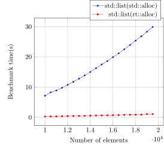

## Node allocators in C++

### Table of contents

* [Introduction](#introduction)
* [Motivation and scope](#motivation-and-scope)
* [Impact on the Standard](#impact-on-the-standard)
* [Sample implementation](#Sample-implementation)
* [Benchmarks](#Benchmarks)
* [Building the project](#Building-the-project)
* [References](#references)

### Introduction

The importance of linked data structures in computer science,
like trees and linked lists, cannot be over-emphasised, yet, in
the last couple of years it has become a common trend in C++ to
move away from such data structures due to their sub-optimal
memory access patterns.  In fact, many people today prefer too
use the flat alternatives and pay O(n) insertion time than O(1)
at the cost of memory fragmentation and unpredictable performance
loss.

On some domains, like realtime applications or systems that aim
24/7 availability, the unpredictability introduced by memory
fragmentation is simply unaffordable.

Even though the sub-optimal access patterns are inherent to
linked data structures, we think that a small non-breaking
addition on the C++ standard could strongly improve performance
and render c++ node-based containers usable even hard-real-time
contexts.

The core of the idea is to make node-based containers support
allocators that use pre-allocated nodes that are linked as a
stack. When an element is inserted in the container the allocator
pops one node from the stack, when an element is removed the
allocator pushes it back into the stack.  Pushing and popping
from a stack are O(1) operations that do not depend how
fragmented the memory is.

The allocate and deallocate member functions look like this in
node-based allocators.

```c++
pointer allocate()
{
  pointer p = m_stack.pop(); 
  if (!p)
    throw std::bad_alloc();
  return p; 
}

void deallocate(pointer p)
{
  m_stack.push(p);
}
```

As the reader may have noticed, these functions differ from their
standard definitions by the fact that they do not have an
argument to inform the size to be allocated or deallocated. It is
not possible to allocate more than one consecutive node.

The node_based allocators proposed here can be used just like any
other allocator, for example

```c++
  std::array<char, 2000> buffer = {{}};
  rt::node_allocator<int> alloc(buffer);

  std::list<int, rt::node_allocator<int>> t1(alloc);
  t1 = {5, 3, 7, 20, 1, 44, 22, 8};

  print(t1);
```

### Motivation

* Keep all nodes in sequential memory addresses improving
  data locality and reducing memory fragmentation.

* Support the most natural allocation scheme for linked data
  structures.

* Achieve platform independent and hard realtime node allocation
  since it does not rely on any algorithm.

* Most node-based container implementations seems to already
  support this kind of allocation. In fact it seems that allowing
  allocate(n) t be called with n != 1 is an unused flexibility we
  are paying for.

### Impact on the Standard

This proposal does not require any breaking change. We require
node-based containers to support the following additional member
functions

```c++
pointer allocator_type::allocate()
void allocator_type::deallocate(pointer p)
```
It is also necessary to add a compile time constant in
std::allocator_traits so that container implementors have means
to know which function has to be used.

```c++
std::allocator_traits<node_allocator<node_type>>::use_allocate_no_arg
```
### Sample implementation

An example implementation is available in this project. It has
been tested with std::list, std::forward_list, std::set and
std::map.

### Benchmarks

The figures below show the bencharks I have made to
compare the performance of std::set and std::list with
various allocators. They are


  1. `std::allocator`.
  2. `rt::allocator`. (The node allocator.)
  3. `__gnu_cxx::__pool_alloc`.
  4. `__gnu_cxx::bitmap_alloc`.
  5. `__gnu_cxx::__mt_alloc`.
  6. `boost::constainer::node_allocator<int, 100000, 1>`.
  7. `boost::constainer::node_allocator<int, 100000, 2>`.

The benchmarks are performed on a scenario with a fragmented
heap, where I dynamically allocate many `char`'s on the heap
and leave some holes for the nodes that will be allocated by
the container. 

,
,

As the reader can see, the node allocator was never slower
the all other allocators. This shows efficient they are.

### Building the project

  To compile you will need a C++11 compiler and CMake. This
  is the command I use on cmake (maybe without all the
  optimization flags):

  cmake ../../rtcpp/ \
  -DCMAKE_CXX_FLAGS="-Wall -Wextra -Werror -std=c++0x" \
  -DCMAKE_BUILD_TYPE=Release \
  -DCMAKE_CXX_COMPILER=g++ -DBOOST_ROOT=${BOOST}

  I have tested the code with the following compilers.

  GCC 4.7.3
  GCC 4.8.2
  GCC 5.0
  Clang 3.4

### References

* [Knuth](The Art of Computer Programming)

