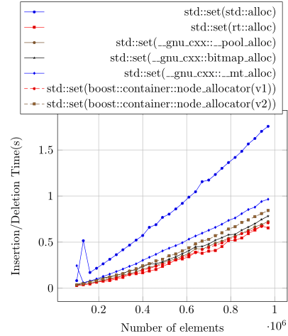
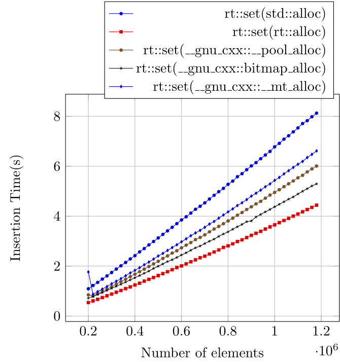

## RTCPP

  The goal of this project is to make real-time use of STL containers by
  means of *real-time allocators*.  *real-time* here means a guarantee that the
  program will execute a particular task in at most n steps (or processor
  cycles).
  
  In the benchmarks section below I compare the performance of the following
  allocators:

  1. `std::allocator`.
  2. `rt::allocator`. (The real-time allocator.)
  3. `__gnu_cxx::__pool_alloc`.
  4. `__gnu_cxx::bitmap_alloc`.
  5. `__gnu_cxx::__mt_alloc`.
  6. `boost::constainer::node_allocator<int, N, 1>`.
  7. `boost::constainer::node_allocator<int, N, 2>`.

  **I highly recommend you to see the graphs below before continuing**.
  On all my benchmarks, the real-time allocators was the fastest.  It can be use just
  like any other allocator, for example:

```c++
  std::array<char, 2000> buffer = {{}};
  rt::allocator<int> alloc(buffer);

  std::list<int, rt::allocator<int>> t1(alloc);
  t1 = {5, 3, 7, 20, 1, 44, 22, 8};

  print(t1);
```
In the code snippet above, we see a 1000 bytes buffer being shared among t1 and
t2.  All memory allocations happen inside the buffer and no call to operator
new is made. It makes the most efficient memory usage as all nodes are
allocated sequentially, that means you can easily fit them all on the cache.
For more example see the examples directory.

## Real-time C++

  When the C++ standard places a guarantee that a given operation, like
  constant time complexity on an `std::list::insert`, it means operations
  inside the list and does not account for the complexity of each node
  allocation, which may not be constant and usually depends on the allocation
  algorithm and external things like heap fragmentation.

  This unpredictability is very undesirable in many applications like 24/7,
  real-time and safe critical systems.

  To make a real-time guarantee on a given operation, we have to get rid of all
  sources of unpredictable behaviour, some of them are.
  
  1. Dynamic allocations of the heap.
  2. Heap fragmentation.
  3. Use of exceptions.

  It is debatable whether use of exceptions is really important, therefore I
  will not focus on it.

## Rationale

In this section I will try to give the user an overview of the design
of the real-time allocator `rt::allocator`.

The first important thing is: **it is designed for node-based containers**
and should not be used with other containers.

It is designed as a stack. To allocate a node one pop's from the stack,
to deallocate you  push on it. Something like.

```c++
  pointer allocate(size_type) { return m_stack.pop(); }
  void deallocate(pointer p, size_type) { m_stack.push(p); }
```

There are many difficulties for writing such an allocator. I will try to list
them here.

1. On node-based containers, the allocator is rebound to serve nodes instead
of the allocator `value_type`. That makes it difficult to link the stack, since
the container node type is not exposed to the user.

2. The use of `::allocate(n)` with `n != 1` cannot be achieved since the nodes
are linked together and there is no guarantee that they are sequential.

## Benchmarks

The links below shows the time taken to fill a `std::set` and my own
implementation of it `rt::set. Each one is tested with five allocators:

  1. `std::allocator`.
  2. `rt::allocator`. (The real-time allocator.)
  3. `__gnu_cxx::__pool_alloc`.
  4. `__gnu_cxx::bitmap_alloc`.
  5. `__gnu_cxx::__mt_alloc`.
  6. `boost::constainer::node_allocator<int, 100000, 1>`.
  7. `boost::constainer::node_allocator<int, 100000, 2>`.

  The benchmarks are performed on a scenario with a fragmented heap, where I
  dynamically allocate many `char`'s on the heap and leave some holes for the nodes
  that will be allocated by the container. 

  It is impressive how much performance improvement one can have by just
  changing the allocator.

, ,

##Compilation

  To compile you will need a C++11 compiler and CMake. This is the command I
  use on cmake (maybe without all the optimization flags):

  cmake ../../rtcpp/ -DCMAKE_CXX_FLAGS="-Wall -Wextra -Werror -std=c++0x -Ofast -fipa-pta \
  -flto -funsafe-loop-optimizations -fno-exceptions -fno-rtti" -DCMAKE_BUILD_TYPE=Release \
  -DCMAKE_CXX_COMPILER=g++ -DBOOST_ROOT=${BOOST}

  I have tested the code with the following compilers.

  GCC 4.7.3
  GCC 4.8.2
  GCC 5.0
  Clang 3.4

##Credits

Most of what is implemented here was taken from the book "The Art of Computer
Programming Vol. 1 and 3".

